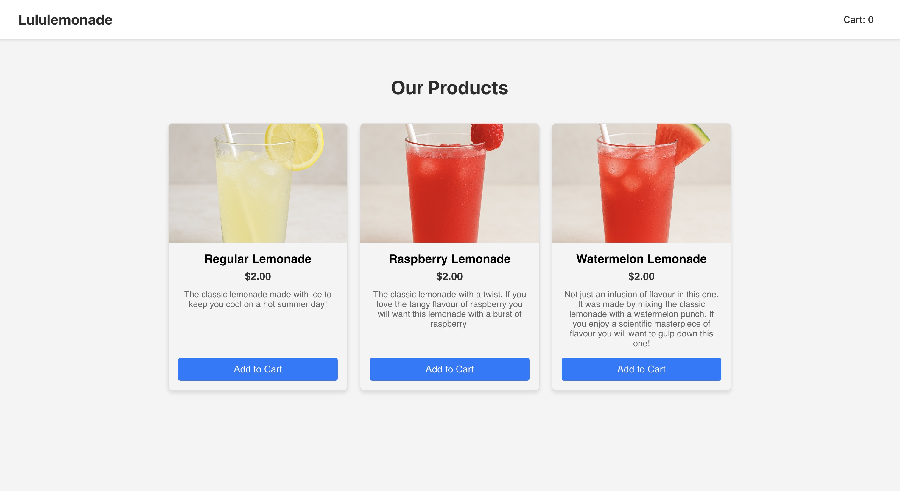
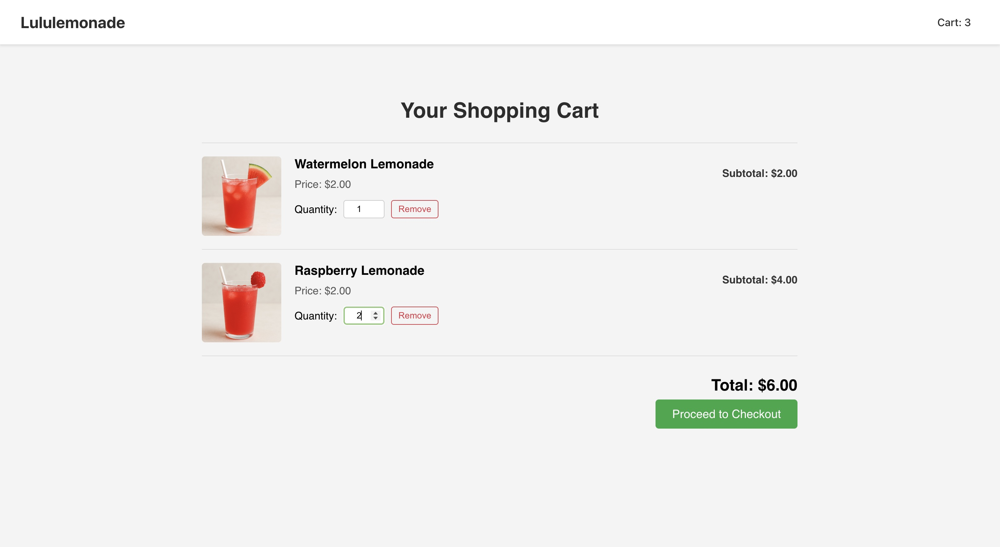
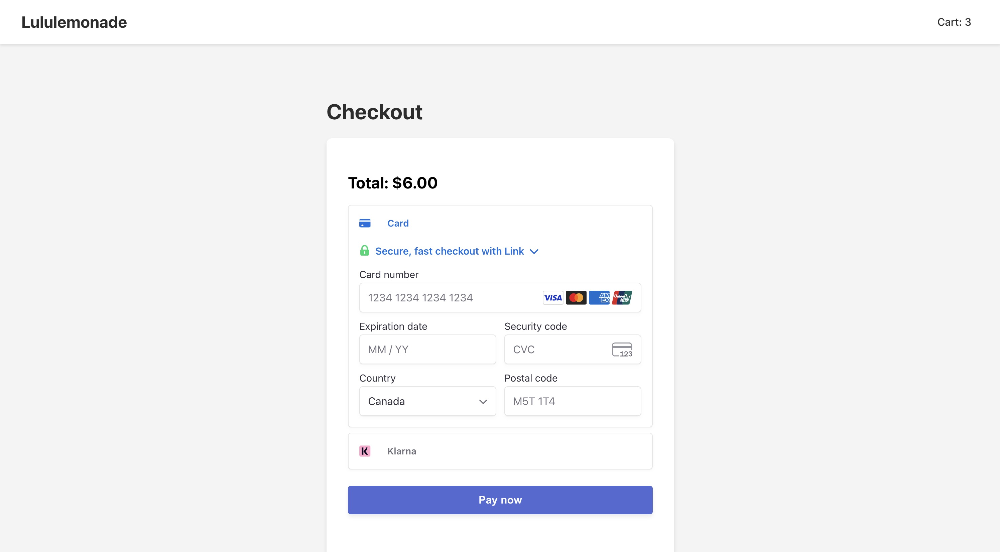

# Lululemonade


[Deployed App](https://lululemonade.netlify.app/)

> **A fun mini web app for use as a lemonade stand to allow customers to make online digital purchases.**  

---





## Overview

*Lululemonade uses React.js framework for front-end and UI and Stripe API for cart, checkout and payment processing.*

### Core features

- Select lemonade you want to purchase and add to cart
- You can go to cart to edit, update, and delete product quantities
- You can checkout with the top onlibe payment options using Stripes API

---

## Getting Started

### Prerequisites

- Node.js 18+ (LTS recommended)
- `pnpm` or `yarn` package manager
- *(Any required backend services, e.g. database?)*

### Install and run

```sh
pnpm install
pnpm dev
# or
yarn install
yarn dev
